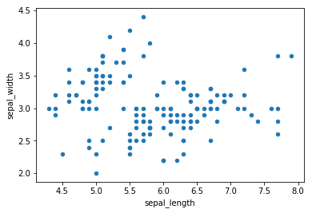
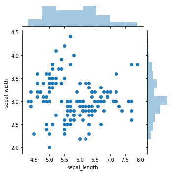
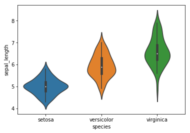
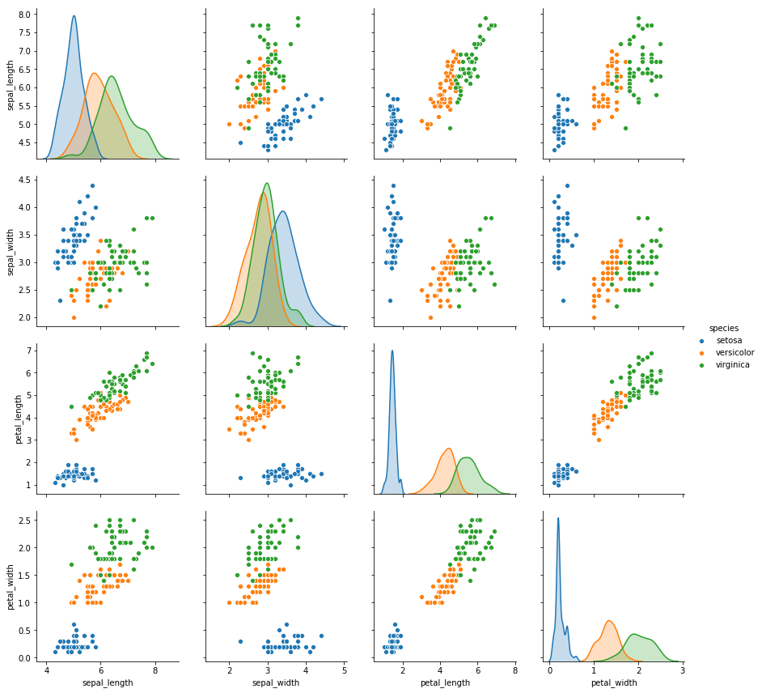

_Below is a markdown file from the notebook `Some code samples.ipynb`. It is the exact same content, you can preview it without having to upload the notebook anywhere._  
 

# Python Question

## Introduction

This is a small notebook including code snippets you might get during the final Quiz.  
Again, you will have 10 questions related to Python/SQL, here are some python snippets

## Importing Packages

Here, I am importing packages I'm using and letting you know the exact version I am on. The goal is not for you to remember these lines, but to give you my current set up.  

If you run the exact same notebook from your environment, you might not work with the same version and thus, you might get different output, or errors if you are missing packages.  

**It's no big deal! Don't struggle if you are missing them**, everything is displayed in the notebook (you don't have to run it all)


```python
#load packages
import sys
print("Python version: {}". format(sys.version))

import pandas as pd
print("pandas version: {}". format(pd.__version__))

import matplotlib
print("matplotlib version: {}". format(matplotlib.__version__))

import seaborn as sns
print("seaborn version: {}". format(sns.__version__))

import warnings
warnings.filterwarnings("ignore")
```

    Python version: 3.6.10 |Anaconda, Inc.| (default, Jan  7 2020, 15:01:53) 
    [GCC 4.2.1 Compatible Clang 4.0.1 (tags/RELEASE_401/final)]
    pandas version: 0.23.0
    matplotlib version: 2.2.2
    seaborn version: 0.9.0


## Pandas


```python
# I'm loading a dataset using seaborn, you will need to install it from your environment
df = sns.load_dataset('iris')
```


```python
# displaying the first 5 rows
df.head(5)
```


<div>
<style scoped>
    .dataframe tbody tr th:only-of-type {
        vertical-align: middle;
    }

    .dataframe tbody tr th {
        vertical-align: top;
    }

    .dataframe thead th {
        text-align: right;
    }
</style>
<table border="1" class="dataframe">
  <thead>
    <tr style="text-align: right;">
      <th></th>
      <th>sepal_length</th>
      <th>sepal_width</th>
      <th>petal_length</th>
      <th>petal_width</th>
      <th>species</th>
    </tr>
  </thead>
  <tbody>
    <tr>
      <th>0</th>
      <td>5.1</td>
      <td>3.5</td>
      <td>1.4</td>
      <td>0.2</td>
      <td>setosa</td>
    </tr>
    <tr>
      <th>1</th>
      <td>4.9</td>
      <td>3.0</td>
      <td>1.4</td>
      <td>0.2</td>
      <td>setosa</td>
    </tr>
    <tr>
      <th>2</th>
      <td>4.7</td>
      <td>3.2</td>
      <td>1.3</td>
      <td>0.2</td>
      <td>setosa</td>
    </tr>
    <tr>
      <th>3</th>
      <td>4.6</td>
      <td>3.1</td>
      <td>1.5</td>
      <td>0.2</td>
      <td>setosa</td>
    </tr>
    <tr>
      <th>4</th>
      <td>5.0</td>
      <td>3.6</td>
      <td>1.4</td>
      <td>0.2</td>
      <td>setosa</td>
    </tr>
  </tbody>
</table>
</div>


```python
# displaying a sample of my dataset
df.sample(5)
```


<div>
<style scoped>
    .dataframe tbody tr th:only-of-type {
        vertical-align: middle;
    }

    .dataframe tbody tr th {
        vertical-align: top;
    }

    .dataframe thead th {
        text-align: right;
    }
</style>
<table border="1" class="dataframe">
  <thead>
    <tr style="text-align: right;">
      <th></th>
      <th>sepal_length</th>
      <th>sepal_width</th>
      <th>petal_length</th>
      <th>petal_width</th>
      <th>species</th>
    </tr>
  </thead>
  <tbody>
    <tr>
      <th>18</th>
      <td>5.7</td>
      <td>3.8</td>
      <td>1.7</td>
      <td>0.3</td>
      <td>setosa</td>
    </tr>
    <tr>
      <th>98</th>
      <td>5.1</td>
      <td>2.5</td>
      <td>3.0</td>
      <td>1.1</td>
      <td>versicolor</td>
    </tr>
    <tr>
      <th>137</th>
      <td>6.4</td>
      <td>3.1</td>
      <td>5.5</td>
      <td>1.8</td>
      <td>virginica</td>
    </tr>
    <tr>
      <th>45</th>
      <td>4.8</td>
      <td>3.0</td>
      <td>1.4</td>
      <td>0.3</td>
      <td>setosa</td>
    </tr>
    <tr>
      <th>131</th>
      <td>7.9</td>
      <td>3.8</td>
      <td>6.4</td>
      <td>2.0</td>
      <td>virginica</td>
    </tr>
  </tbody>
</table>
</div>


```python
# computing basic descriptive stats
df.describe()
```


<div>
<style scoped>
    .dataframe tbody tr th:only-of-type {
        vertical-align: middle;
    }

    .dataframe tbody tr th {
        vertical-align: top;
    }

    .dataframe thead th {
        text-align: right;
    }
</style>
<table border="1" class="dataframe">
  <thead>
    <tr style="text-align: right;">
      <th></th>
      <th>sepal_length</th>
      <th>sepal_width</th>
      <th>petal_length</th>
      <th>petal_width</th>
    </tr>
  </thead>
  <tbody>
    <tr>
      <th>count</th>
      <td>150.000000</td>
      <td>150.000000</td>
      <td>150.000000</td>
      <td>150.000000</td>
    </tr>
    <tr>
      <th>mean</th>
      <td>5.843333</td>
      <td>3.057333</td>
      <td>3.758000</td>
      <td>1.199333</td>
    </tr>
    <tr>
      <th>std</th>
      <td>0.828066</td>
      <td>0.435866</td>
      <td>1.765298</td>
      <td>0.762238</td>
    </tr>
    <tr>
      <th>min</th>
      <td>4.300000</td>
      <td>2.000000</td>
      <td>1.000000</td>
      <td>0.100000</td>
    </tr>
    <tr>
      <th>25%</th>
      <td>5.100000</td>
      <td>2.800000</td>
      <td>1.600000</td>
      <td>0.300000</td>
    </tr>
    <tr>
      <th>50%</th>
      <td>5.800000</td>
      <td>3.000000</td>
      <td>4.350000</td>
      <td>1.300000</td>
    </tr>
    <tr>
      <th>75%</th>
      <td>6.400000</td>
      <td>3.300000</td>
      <td>5.100000</td>
      <td>1.800000</td>
    </tr>
    <tr>
      <th>max</th>
      <td>7.900000</td>
      <td>4.400000</td>
      <td>6.900000</td>
      <td>2.500000</td>
    </tr>
  </tbody>
</table>
</div>


```python
print(df.species.nunique())
print(df.species.unique())
```

    3
    ['setosa' 'versicolor' 'virginica']


```python
# displaying a new dataframe based on a condition
df[df["sepal_length"]>7]
```


<div>
<style scoped>
    .dataframe tbody tr th:only-of-type {
        vertical-align: middle;
    }

    .dataframe tbody tr th {
        vertical-align: top;
    }

    .dataframe thead th {
        text-align: right;
    }
</style>
<table border="1" class="dataframe">
  <thead>
    <tr style="text-align: right;">
      <th></th>
      <th>sepal_length</th>
      <th>sepal_width</th>
      <th>petal_length</th>
      <th>petal_width</th>
      <th>species</th>
    </tr>
  </thead>
  <tbody>
    <tr>
      <th>102</th>
      <td>7.1</td>
      <td>3.0</td>
      <td>5.9</td>
      <td>2.1</td>
      <td>virginica</td>
    </tr>
    <tr>
      <th>105</th>
      <td>7.6</td>
      <td>3.0</td>
      <td>6.6</td>
      <td>2.1</td>
      <td>virginica</td>
    </tr>
    <tr>
      <th>107</th>
      <td>7.3</td>
      <td>2.9</td>
      <td>6.3</td>
      <td>1.8</td>
      <td>virginica</td>
    </tr>
    <tr>
      <th>109</th>
      <td>7.2</td>
      <td>3.6</td>
      <td>6.1</td>
      <td>2.5</td>
      <td>virginica</td>
    </tr>
    <tr>
      <th>117</th>
      <td>7.7</td>
      <td>3.8</td>
      <td>6.7</td>
      <td>2.2</td>
      <td>virginica</td>
    </tr>
    <tr>
      <th>118</th>
      <td>7.7</td>
      <td>2.6</td>
      <td>6.9</td>
      <td>2.3</td>
      <td>virginica</td>
    </tr>
    <tr>
      <th>122</th>
      <td>7.7</td>
      <td>2.8</td>
      <td>6.7</td>
      <td>2.0</td>
      <td>virginica</td>
    </tr>
    <tr>
      <th>125</th>
      <td>7.2</td>
      <td>3.2</td>
      <td>6.0</td>
      <td>1.8</td>
      <td>virginica</td>
    </tr>
    <tr>
      <th>129</th>
      <td>7.2</td>
      <td>3.0</td>
      <td>5.8</td>
      <td>1.6</td>
      <td>virginica</td>
    </tr>
    <tr>
      <th>130</th>
      <td>7.4</td>
      <td>2.8</td>
      <td>6.1</td>
      <td>1.9</td>
      <td>virginica</td>
    </tr>
    <tr>
      <th>131</th>
      <td>7.9</td>
      <td>3.8</td>
      <td>6.4</td>
      <td>2.0</td>
      <td>virginica</td>
    </tr>
    <tr>
      <th>135</th>
      <td>7.7</td>
      <td>3.0</td>
      <td>6.1</td>
      <td>2.3</td>
      <td>virginica</td>
    </tr>
  </tbody>
</table>
</div>


```python
# creating a new dataframe called df_ where sepal_length>7
df_ = df[df["sepal_length"]>7]

print(len(df_))

df_.tail(5)
```

    12


<div>
<style scoped>
    .dataframe tbody tr th:only-of-type {
        vertical-align: middle;
    }

    .dataframe tbody tr th {
        vertical-align: top;
    }

    .dataframe thead th {
        text-align: right;
    }
</style>
<table border="1" class="dataframe">
  <thead>
    <tr style="text-align: right;">
      <th></th>
      <th>sepal_length</th>
      <th>sepal_width</th>
      <th>petal_length</th>
      <th>petal_width</th>
      <th>species</th>
    </tr>
  </thead>
  <tbody>
    <tr>
      <th>125</th>
      <td>7.2</td>
      <td>3.2</td>
      <td>6.0</td>
      <td>1.8</td>
      <td>virginica</td>
    </tr>
    <tr>
      <th>129</th>
      <td>7.2</td>
      <td>3.0</td>
      <td>5.8</td>
      <td>1.6</td>
      <td>virginica</td>
    </tr>
    <tr>
      <th>130</th>
      <td>7.4</td>
      <td>2.8</td>
      <td>6.1</td>
      <td>1.9</td>
      <td>virginica</td>
    </tr>
    <tr>
      <th>131</th>
      <td>7.9</td>
      <td>3.8</td>
      <td>6.4</td>
      <td>2.0</td>
      <td>virginica</td>
    </tr>
    <tr>
      <th>135</th>
      <td>7.7</td>
      <td>3.0</td>
      <td>6.1</td>
      <td>2.3</td>
      <td>virginica</td>
    </tr>
  </tbody>
</table>
</div>


## Generic Python


```python
x = 14
```


```python
def f(x):
    x = x*2
    return 2,x

print(f(9),'\n')
print(7,'f(9)','\n')
print(x,f(5),'\n')
print(8,f(5),'\n')
```

    (2, 18) 
    
    7 f(9) 
    
    14 (2, 10) 
    
    8 (2, 10) 
    


```python
my_str = 'This is a string'
my_list = ['This','is','a','list']
my_array = df.species.unique()
my_dict = {'a':'This','b':'Is','c':'a','d':'dictionnary'}
my_tuple = ('this','is',1,'tuple')
my_float = 3.14
```

## Visualisations


```python
df.columns
```


    Index(['sepal_length', 'sepal_width', 'petal_length', 'petal_width',
           'species'],
          dtype='object')


```python
df.plot(kind="scatter", x="sepal_length", y="sepal_width")
```


    <matplotlib.axes._subplots.AxesSubplot at 0x1a1602a780>





```python
sns.jointplot(x="sepal_length", y="sepal_width", data=df, size=5)
```


    <seaborn.axisgrid.JointGrid at 0x1a215e7b00>





```python
sns.violinplot(x="species", y="sepal_length", data=df, size=6)
```


    <matplotlib.axes._subplots.AxesSubplot at 0x1a217bceb8>





```python
sns.pairplot(df, hue="species", size=3)
```


    <seaborn.axisgrid.PairGrid at 0x1a2178f630>




